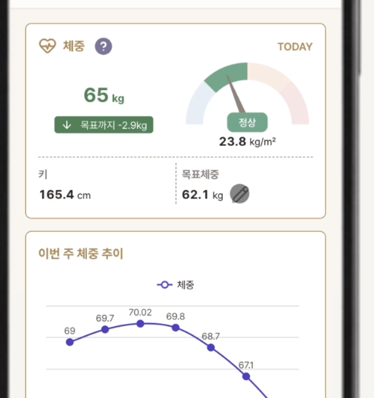
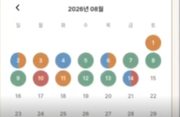
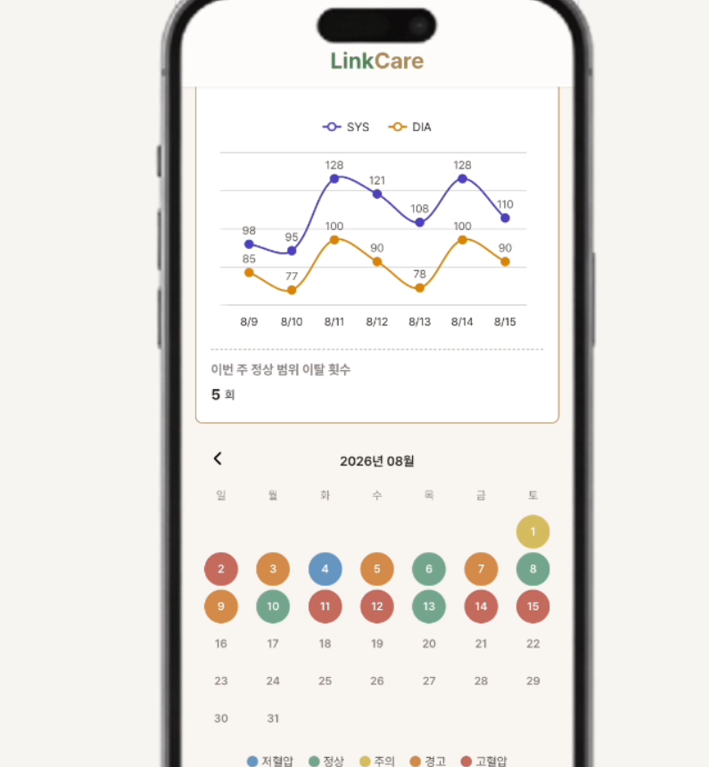
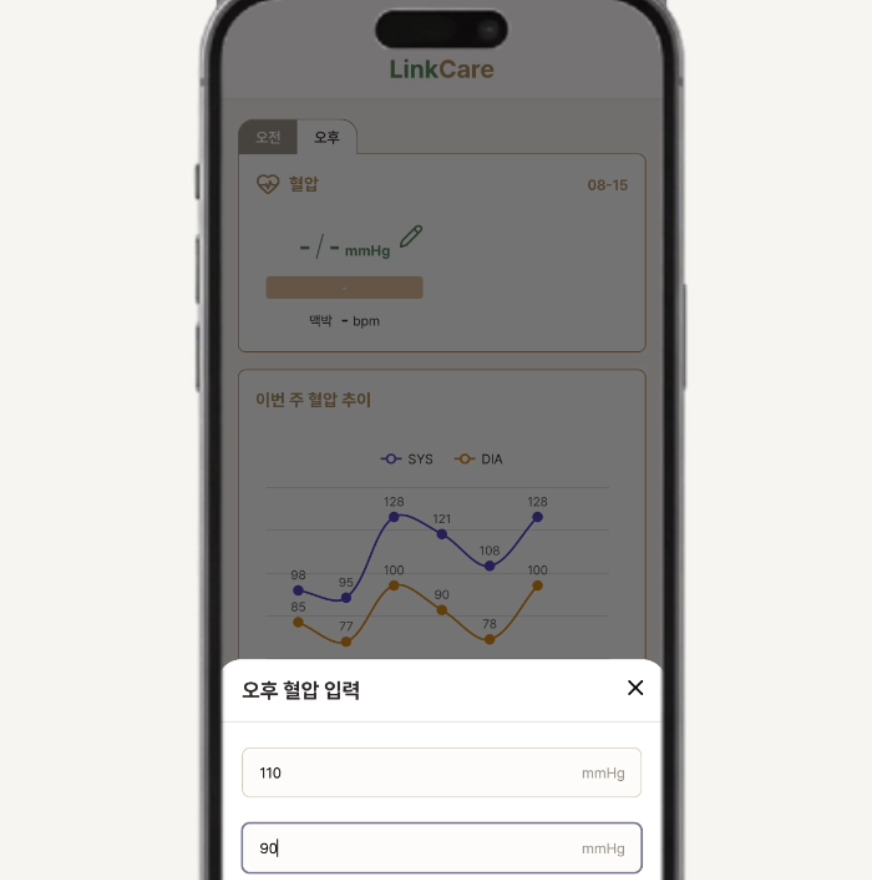
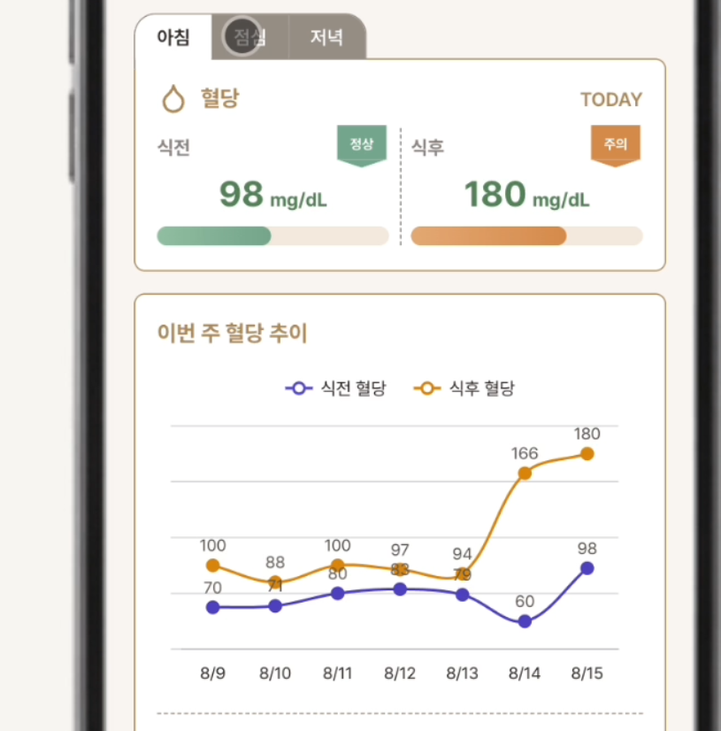
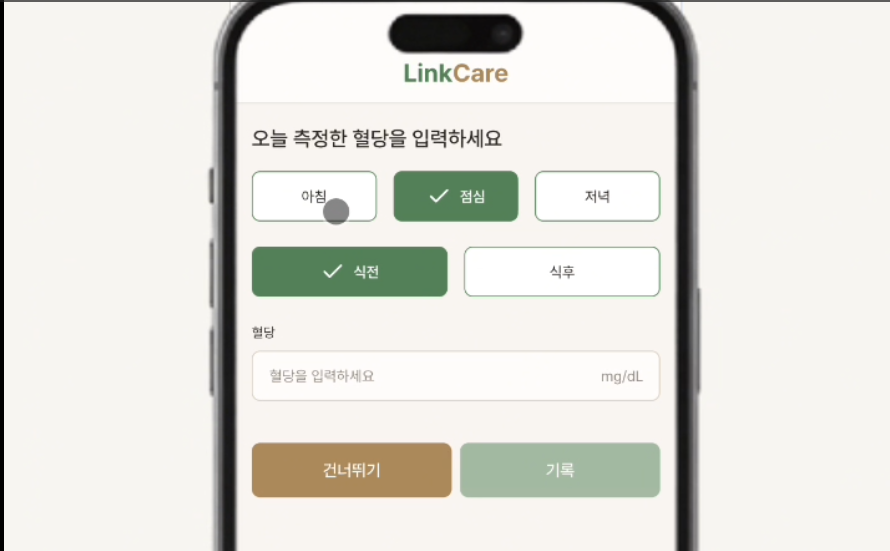
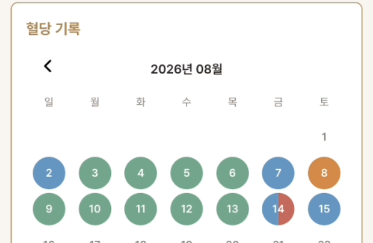

#  LinkCare — 나에게 핏한 건강관리 에이전트

<p>
  
  
  
  
  
  
</p>

> 이 저장소는 **4인 팀 프로젝트**(2026.07.15 ~ 2026.08.07, 남부여성발전센터 클라우드 기반 생성형 AI 활용 웹개발 실무 과정)로 진행한 결과물을 포트폴리오 정리를 위해 개인 계정에 복제한 것입니다.
> 원본 팀 저장소: [Jeon-Dabeen/LinkCare](https://github.com/Jeon-Dabeen/LinkCare)
> 아래 내용은 팀 프로젝트 전체 소개와, 그중 **제가(오유진) 담당한 Daily 건강관리(체중·혈압·혈당) 도메인**을 구분하여 작성했습니다.

##  목차

- [한눈에 보기](#-한눈에-보기)
- [프로젝트 소개](#-프로젝트-소개)
- [제가 담당한 부분 — Daily 건강관리](#-제가-담당한-부분--daily-건강관리)
  - [1. 체중](#1-체중--하루-1회-목표-방향-판정)
  - [2. 혈압](#2-혈압--아침저녁-더-위험한-쪽으로-최종-판정)
  - [3. 혈당](#3-혈당--식전식후를-한-달력에-담기)
- [문제 해결](#-문제-해결)
- [API 엔드포인트](#-api-엔드포인트)
- [데이터 모델 요약](#-데이터-모델-요약)
- [회고](#-회고)
- [팀 프로젝트 전체 개요](#-팀-프로젝트-전체-개요-참고)

##  한눈에 보기

Daily 건강관리(체중·혈압·혈당) 도메인을 기획부터 DB 설계, API, 프론트 연동까지 전 과정 담당했습니다. BMI 계산·목표체중 판정 로직을 커밋 3번에 걸쳐 재설계했고, 혈당은 식전·식후 상태가 동시에 다를 수 있는 문제를 반원 캘린더로 직접 설계해 풀었습니다.

##  프로젝트 소개

국민건강보험 건강검진 데이터와 일상 건강기록을 바탕으로 사용자가 자신의 건강 상태와 생활 습관을 꾸준히 관리하고, AI의 조언을 받을 수 있는 헬스케어 모바일 웹 서비스입니다.

- **팀 구성**: 4명 · **개발 기간**: 2026.07.15 ~ 2026.08.07
- **기술 스택**: Next.js(App Router) · TypeScript(Frontend) / NestJS · TypeScript · Prisma(Backend) / PostgreSQL / Azure

전체 기능 중 **체중·혈압·혈당을 기록하는 Daily 건강관리 도메인**을 기획·DB 설계·백엔드 API·프론트 연동까지 전 과정 담당했습니다.

---

##  제가 담당한 부분 — Daily 건강관리

세 지표 모두 "매일 기록한다"는 목적은 같지만, 실제 기록 주기와 조합은 다 달랐습니다. 그래서 각 지표의 실제 사용 패턴을 먼저 파악한 뒤 입력 조건 → 상태 판정 → 시각화 순서로 설계했습니다.

### 1. 체중 — 하루 1회, 목표 방향 판정



- 오늘 기록이 없을 때만 입력폼을 띄우고, 있으면 조회만 가능하도록 프론트에서 날짜를 확인해 분기
- 건너뛰기로 메인에 오면 Bottom Sheet에서 바로 입력 가능 (기록만 보고 싶은 사용자도 배려)
- BMI는 프로필의 키를 기준으로 계산, 최근 7일 추이·최근 3개월 달력에 상태별 색상 표시



### 2. 혈압 — 아침/저녁, 더 위험한 쪽으로 최종 판정



- 아침/저녁 탭 전환 시 화면 전체 데이터가 해당 시간대 기록으로 바뀌는 구조
- 해당 시간대에 기록이 없을 때만 입력폼 노출, 있으면 조회만
- **SYS(수축기)·DIA(이완기)를 각각 판정한 뒤 더 위험한 쪽을 최종 상태로 표시** — 저혈압/정상/주의/경고/고혈압 5단계
- 오늘 수치를 수축기·이완기 2축 좌표에 점으로 표시해, 위험 구간(저혈압·정상·주의·위험)에서의 위치를 시각적으로 보여주는 산점도 차트
- 건너뛰기로 들어온 경우 "현재 시간대" 탭을, 입력을 완료한 경우 "입력한 시간대" 탭을 보여주도록 구분 (점심시간에 아침 기록을 입력해도 아침 탭 유지)

 

### 3. 혈당 — 식전·식후를 한 달력에 담기

가장 고민이 많았던 지표입니다. 아침·점심·저녁 × 식전·식후 조합이라 체중·혈압과 같은 방식으로는 풀리지 않았습니다.

 

- 아침/점심/저녁 탭 + 식전/식후 두 조건이 함께 존재 — 해당 시간대에 식전·식후 중 **하나라도 기록이 있으면** 입력폼을 띄우지 않도록 처리 (매번 뜨면 사용자가 피로해질 거라 판단)
- Prisma 복합 유니크(`userId · bgDate · mealType · mealTiming`)로 동일 조건 중복 등록을 DB 레벨에서 차단
- 조회 시 백엔드에서 식전·식후 레코드를 날짜별로 묶어(`groupByDate`) 하나의 응답으로 반환

**달력 표현의 문제**: 혈압은 "더 위험한 쪽"으로 합쳐서 하나의 색으로 표시할 수 있었지만, 혈당은 식전 저혈당 + 식후 고혈당이 동시에 나올 수 있어 다른방법을 사용했습니다.
달력 한 칸을 반원으로 나눠 **왼쪽은 식전, 오른쪽은 식후** 상태를 각각 다른 색으로 동시에 표현하는 방식으로 설계했습니다.



반원은 식전·식후가 **서로 다른 이상 상태(저혈당·주의·고혈당·위험)로 겹칠 때만** 표시됩니다. 정상은 그 자체로 "볼 필요 없는 상태"라 반원에 넣지 않았고, 정상과 이상 상태가 겹치면 그냥 이상 상태 단색으로 표시했습니다. 하루에 확인해야 할 이상 신호만 남기기 위한 선택이었습니다.

##  문제 해결

<details>
<summary><b>① BMI 계산 — 키를 매 요청마다 받다가, 프로필 필수값으로 통일</b></summary>
<br>

처음엔 체중 입력 시 키를 선택적으로 함께 받아 BMI를 계산했습니다. 그런데 **키를 입력한 경우 / 안 한 경우 / 나중에 추가한 경우 / 나중에 변경한 경우**, 그리고 이전 BMI를 어떻게 처리할지까지 분기가 계속 늘어났습니다.

키는 프로필에서 한 번만 관리하도록 통일하고, 체중 등록 API의 DTO에서 `height` 필드 자체를 제거했습니다. 분기를 하나씩 처리하기보다, **분기가 생기는 원인(키를 여러 곳에서 받는 구조) 자체를 없애는 방향**으로 풀었습니다.

</details>

<details>
<summary><b>② 목표체중 판정 — 매번 계산하다가, 방향이 바뀔 때만 재계산</b></summary>
<br>

감량을 목표로 한 사용자가 목표보다 더 감량하면(예: 목표 60kg인데 59kg 도달) 단순 차이 계산 로직에서는 오히려 "1kg 증량하세요"로 안내되는 문제가 있었습니다.

목표 설정 시 감량(`-`)/증량(`+`)/유지(`0`) 상태를 DB에 저장해두고, **새로운 목표체중을 입력할 때만 재계산**하도록 분리했습니다. 목표체중 입력도 최초 1회만 체중 입력폼과 함께 받고, 이후에는 메인 화면에서 `PATCH /weight/profile`로 독립적으로 수정할 수 있게 바꿔서 "매번 목표를 다시 입력하는" 번거로움도 함께 없앴습니다.

</details>

<details>
<summary><b>③ 7일 조회 — 프론트 머지 방식을 시도했다가, 서버 재조회로 통일</b></summary>
<br>

오늘 기록을 추가로 입력하면 이미 조회해둔 7일 데이터를 다시 통째로 불러오는 게 아깝다고 생각해서, 처음엔 **오늘 하루 데이터만 프론트에서 기존 목록에 머지**하는 방식을 시도했습니다. 체중에서는 문제없이 동작했지만, 혈당에서 식전·식후를 그룹화하는 로직까지 프론트 머지와 맞물리자 복잡도가 급격히 올라가고 엣지 케이스가 늘었습니다. 결국 체중·혈압·혈당 모두 **등록 후 서버에서 재조회하는 방식으로 통일**해 일관성과 안정성을 확보했습니다. (참고로 날짜 기준 시각 계산도 처음엔 서버에서 처리했지만, 이후 팀 합의로 프론트에서 기준 시각을 받는 방식으로 변경했습니다.)

</details>

---

##  API 엔드포인트

| 도메인 | Method | Endpoint | 설명 |
| --- | --- | --- | --- |
| 체중 | POST | `/weight` | 체중 등록 (최초 1회 목표체중 함께 입력) |
| 체중 | GET | `/weight/week` / `/weight/month` | 7일 / 3개월 조회 |
| 체중 | PATCH | `/weight/profile` | 목표체중 · 키 수정 |
| 혈압 | POST | `/blood-pressure` | 혈압 등록 (아침/저녁 구분) |
| 혈압 | GET | `/blood-pressure/week` / `/blood-pressure/month` | 7일 / 3개월 조회 |
| 혈압 | PATCH | `/blood-pressure/:id/pulse` | 맥박 수정 |
| 혈당 | POST | `/blood-glucose` | 혈당 등록 (식사·식전후 구분) |
| 혈당 | GET | `/blood-glucose/week` / `/blood-glucose/month` | 7일 / 3개월 조회 (식전·식후 그룹화 반환) |

모든 API는 `JwtAuthGuard`로 보호되며, `userId`는 토큰에서 추출해 본인 기록만 조회·수정 가능합니다.

##  데이터 모델 요약

```prisma
// 체중: 유저 + 날짜 조합으로 하루 1건만
@@unique([userId, weightDate])

// 혈압: 유저 + 시간대 + 날짜 조합으로 시간대별 1건만
@@unique([userId, dayPeriod, bpDate])

// 혈당: 유저 + 날짜 + 식사종류 + 식전후 조합으로 1건만
@@unique([userId, bgDate, mealType, mealTiming])
```

---

##  회고

- **잘한 점**: 최대한 일관성 있게 구성하였고 사용자 입장에서 이런저런 고려를 하여 만들어보았습니다.
- **아쉬운 점**: 처음부터 ~~했더라면 하는 생각이 많이 듭니다. 데이터 조회에서 프론트 머지 방식에 들어간 시간을 아낀다던가 bmi 계산과 관련하여 시간을 절약할 수 있지 않았을까 하는 아쉬움이 있습니다. 
- **다음에 시도해볼 것, 더 공부할것**: 단위테스트를 시도해보고 싶습니다. 또한 배포를 좀 더 공부하고 경험해볼 예정입니다.

##  팀 프로젝트 전체 개요 (참고)

Daily 건강관리 외의 기능(건강검진 업로드·AI 분석, 식단 관리, 마이페이지 등)은 팀원들이 담당했습니다. 전체 기능 소개는 [원본 팀 저장소 README](https://github.com/Jeon-Dabeen/LinkCare)를 참고해 주세요.
